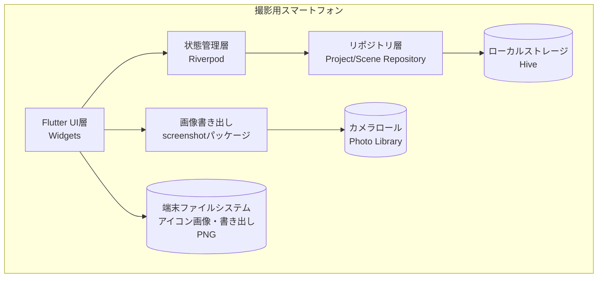
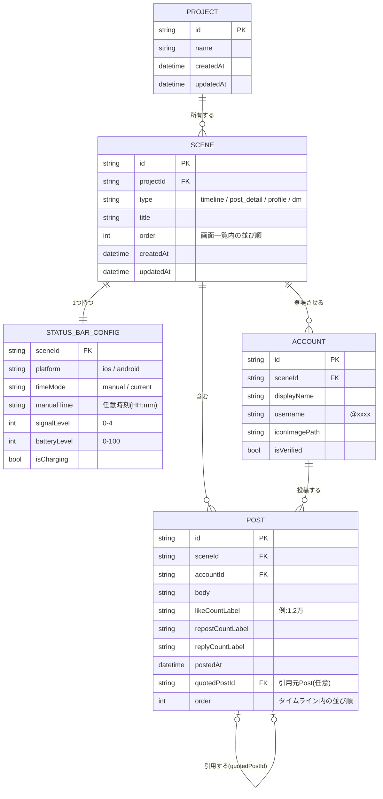
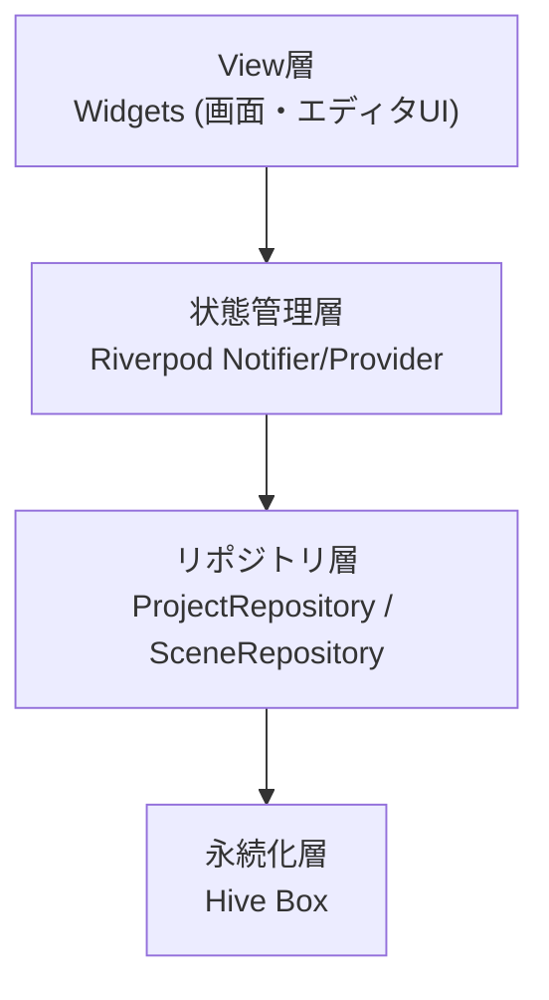
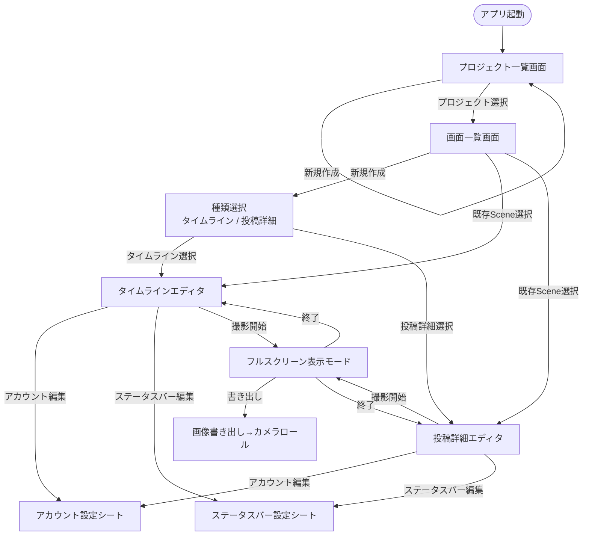

# 機能設計書

## 撮影用ポスト画面メーカー(X版)

> **ステータス:** ドラフト v0.1
> **最終更新:** 2026-08-01
> **対応範囲:** フェーズ1(MVP) を中心に記載。フェーズ2・3は現時点で判明している範囲のみ記載する

---

## 1. システム構成図

本アプリはクラウド・外部サービスを一切使用しない、**端末内で完結するオフラインアプリ**である。



- クラウド同期・サーバーAPIは存在しない(セクション9参照)
- 端末を跨いだデータ共有は行わない(1台完結の運用が前提)

---

## 2. 機能ごとのアーキテクチャ

**共通インフラ + 種類別エディタ** の構造を採用する。

```mermaid
graph LR
    subgraph Common[共通インフラ]
        ProjMgmt[プロジェクト管理]
        SceneMgmt[画面(Scene)管理]
        AccountMgmt[アカウント管理]
        StatusBar[ステータスバー設定]
        Fullscreen[フルスクリーン表示]
        ImageExport[画像書き出し]
    end

    subgraph Editors[種類別エディタ・ビュー]
        TimelineEditor["タイムラインエディタ<br/>(フェーズ1)"]
        PostDetailEditor["投稿詳細エディタ<br/>(フェーズ1)"]
        ProfileEditor["プロフィールエディタ<br/>(フェーズ2)"]
        DMEditor["DMエディタ<br/>(フェーズ3)"]
    end

    ProjMgmt --> SceneMgmt
    SceneMgmt --> TimelineEditor
    SceneMgmt --> PostDetailEditor
    SceneMgmt --> ProfileEditor
    SceneMgmt --> DMEditor
    TimelineEditor --> AccountMgmt
    PostDetailEditor --> AccountMgmt
    TimelineEditor --> StatusBar
    PostDetailEditor --> StatusBar
    TimelineEditor --> Fullscreen
    PostDetailEditor --> Fullscreen
    Fullscreen --> ImageExport
```

- 新規作成時は必ず「種類選択(テンプレート先行方式)」を経由し、選んだ種類専用のエディタのみを表示する(PRD 6.3節)
- タイムライン・投稿詳細は共に「フィード型」の画面構造を持つため、投稿(Post)・アカウント(Account)のレンダリング用ウィジェットを共通化できる
- フルスクリーン表示は、エディタで組み立てたSceneのプレビューと同一のレンダリングウィジェットを使い、OSのシステムUIを隠して全画面表示する

---

## 3. データモデル定義(ER図)

### 3.1 データ階層(概念図)

```
アプリ(1本)
 └─ プロジェクト(Project) ※複数保存可能
     └─ 画面(Scene) ※1プロジェクトに複数持てる
         ├─ 種類(type: timeline / post_detail / profile / dm)
         ├─ ステータスバー設定(StatusBarConfig) ※Sceneに1つ
         ├─ アカウント(Account) ※Scene内で複数登場しうる
         └─ 投稿(Post) ※Scene内で複数持てる。アカウントに紐づく
```

### 3.2 ER図



### 3.3 補足

- `likeCountLabel` などの数値系フィールドは、内部的には表示用の**文字列**として保持する(「1.2万」のような省略表記も自由入力できるようにするため。PRD「重要な設計上の注意点」参照)
- `Account` は `Scene` に従属する(プロジェクト横断・アプリ全体の共有アカウントは持たない)。撮影ごとに独立して作り込める設計を優先する
- `POST` の自己参照(`quotedPostId`)により、投稿詳細エディタでの引用ポスト表示に対応する
- `STATUS_BAR_CONFIG` はSceneに対して1:1。タイムライン・投稿詳細どちらの種類でも同じ設定構造を使う

---

## 4. コンポーネント設計

### 4.1 レイヤー構成



### 4.2 主要コンポーネント一覧(フェーズ1)

| コンポーネント | 種別 | 役割 |
|---|---|---|
| `ProjectListPage` | View | プロジェクトの一覧表示・作成・削除 |
| `SceneListPage` | View | プロジェクト内のScene一覧表示・新規作成(種類選択) |
| `SceneTypePickerSheet` | View | 新規Scene作成時の種類選択(タイムライン/投稿詳細) |
| `AccountEditorSheet` | View | アカウント(名前・ユーザー名・アイコン・認証バッジ)編集 |
| `StatusBarConfigEditorSheet` | View | ステータスバー設定編集(時刻・電波・電池・OS切り替え) |
| `PostDetailEditorPage` | View | 投稿詳細エディタ(本文・数値・日時・引用ポスト) |
| `TimelineEditorPage` | View | タイムラインエディタ(投稿の追加・編集・並び替え) |
| `FakeStatusBar` | View(共通) | iPhone風/Android風ステータスバー描画。編集プレビューとフルスクリーン表示の両方で使用 |
| `PostCard` | View(共通) | 投稿1件分のフィード型表示(タイムライン・投稿詳細で共用) |
| `FullscreenDisplayPage` | View | システムUIを隠した実機表示モード。表示中Sceneのレンダリングのみ行う |
| `ImageExportController` | Controller | 表示中WidgetをキャプチャしPNGとしてカメラロールへ保存 |
| `ProjectNotifier` / `SceneNotifier` | State | Riverpodによる状態管理。編集内容を保持しRepositoryへ反映 |
| `ProjectRepository` / `SceneRepository` | Repository | Hiveへの読み書きを抽象化 |

### 4.3 設計方針

- `PostCard` と `FakeStatusBar` は編集画面のプレビューとフルスクリーン表示モードの**両方で同一Widgetを再利用**し、見た目の乖離を防ぐ
- 種類別エディタ(`TimelineEditorPage` / `PostDetailEditorPage`)は共通の `Account`・`StatusBarConfig` 編集UI(シート)を呼び出す形にし、重複実装を避ける
- フェーズ2以降(`ProfileEditorPage` / `DMEditorPage`)は同じ共通インフラに乗せる前提で、`SceneTypePickerSheet` に選択肢を追加する形で拡張する

---

## 5. ユースケース図

```mermaid
graph TD
    User((制作スタッフ))

    User --> UC1[プロジェクトを作成・管理する]
    User --> UC2[画面(Scene)を作成・管理する]
    User --> UC3[アカウント情報を設定する]
    User --> UC4[ステータスバーを設定する]
    User --> UC5[投稿詳細を編集する]
    User --> UC6[タイムラインを編集する]
    User --> UC7[実機でフルスクリーン表示する]
    User --> UC8[画像として書き出す]

    UC2 -.include.-> UC3
    UC2 -.include.-> UC4
    UC5 -.include.-> UC3
    UC6 -.include.-> UC3
    UC7 -.include.-> UC8
```

---

## 6. 画面遷移図



---

## 7. ワイヤフレーム(概略)

### 7.1 投稿詳細画面(フルスクリーン表示時)

```
┌─────────────────────────────┐
│ 9:41       ●●●●        78%🔋 │ ← FakeStatusBar(iPhone風)
├─────────────────────────────┤
│ ← 戻る                        │
│                               │
│  🙂 表示名  ✓                 │
│     @username                │
│                               │
│  ここに投稿本文が表示される     │
│                               │
│  午後3:00 · 2026年8月1日       │
├─────────────────────────────┤
│ 💬 12   🔁 3.4万   ❤ 1.2万  ⤴ │
└─────────────────────────────┘
```

### 7.2 タイムライン画面(フルスクリーン表示時)

```
┌─────────────────────────────┐
│ 9:41       ●●●●        78%🔋 │
├─────────────────────────────┤
│  🙂 表示名 ✓ @username · 3時間 │
│  投稿本文1行目...              │
│  💬 5  🔁 120  ❤ 890   ⤴      │
├─────────────────────────────┤
│  🙂 表示名2 @username2 · 5時間 │
│  投稿本文...                   │
│  💬 1  🔁 3   ❤ 45     ⤴      │
├─────────────────────────────┤
│              ⋮ (以降スクロール) │
└─────────────────────────────┘
```

- 画像やモックアップが必要になった場合は `docs/images/` に配置し、本ファイルから参照する(現時点ではテキストベースで十分と判断)

---

## 8. API設計

該当なし。

本アプリはクラウド・外部バックエンドと一切連携しない、端末内完結型のオフラインアプリである(PRD 9節、非機能要件を参照)。将来的にバックエンド連携(例:テンプレート共有機能など)を検討する場合は、本セクションを更新する。

---

## 9. 今後の検討事項

- フェーズ2(プロフィール画面)導入時のデータモデル拡張(フォロワー数・投稿一覧などプロフィール固有フィールドの追加)
- フェーズ3(DM画面)導入時の「チャット型」データモデルの設計(LINE版との構造比較を踏まえて別途設計する)
